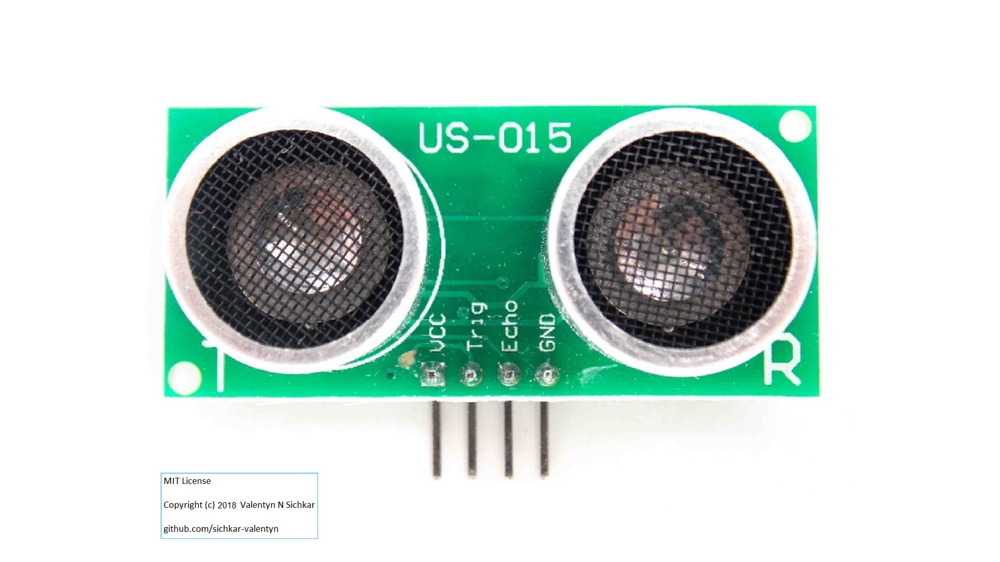
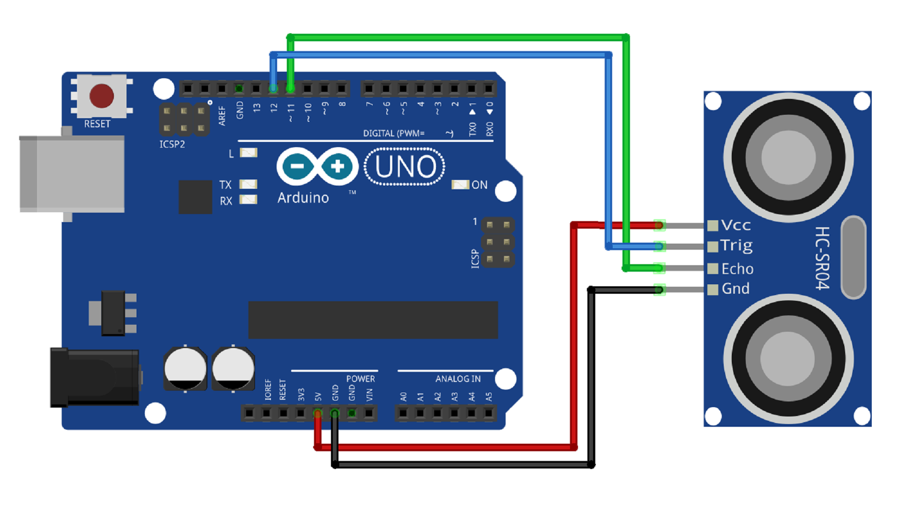
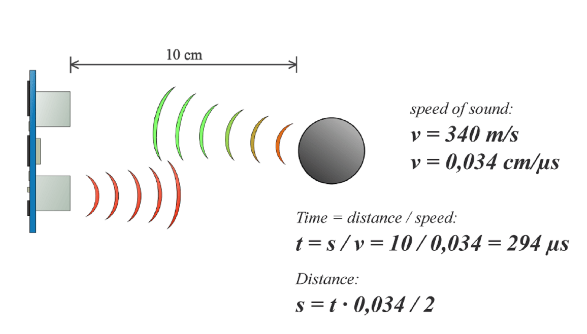
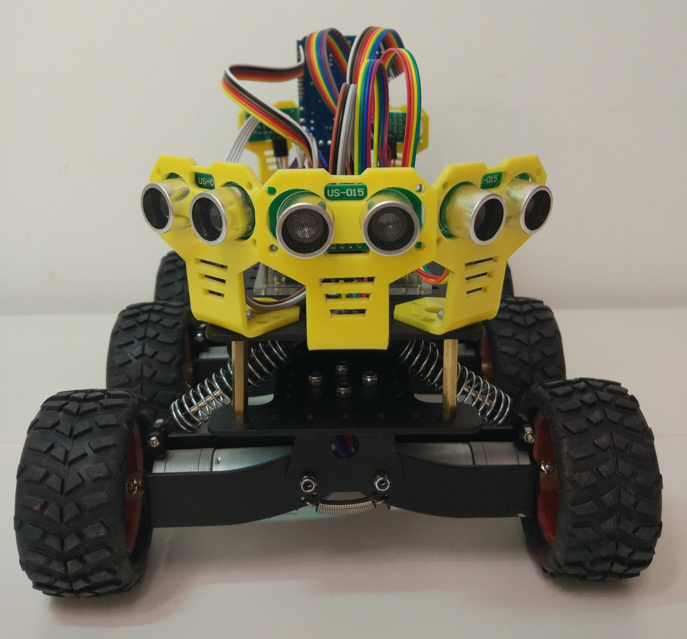
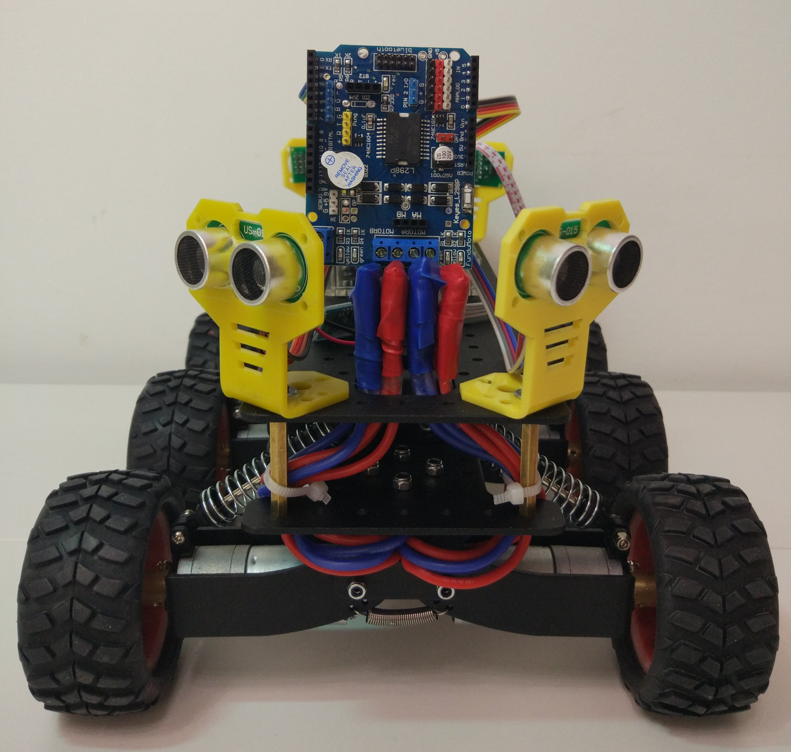
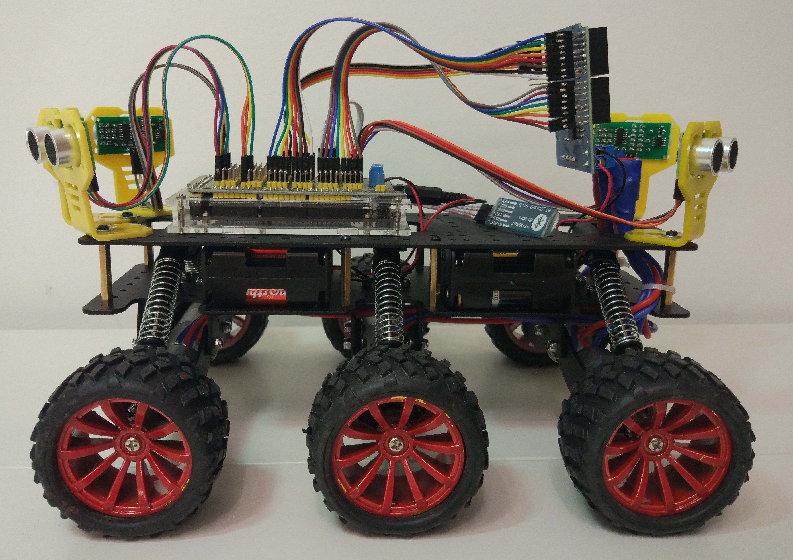
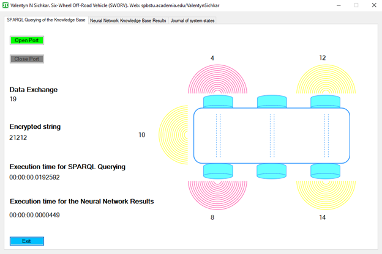
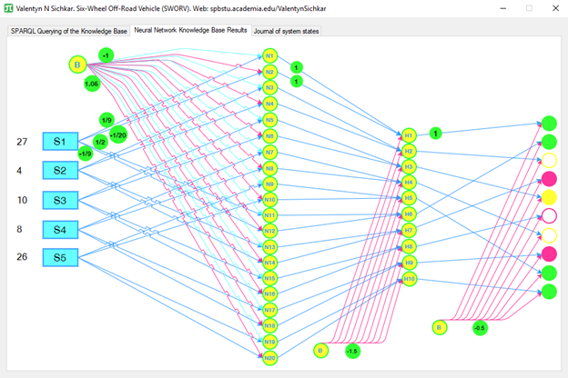
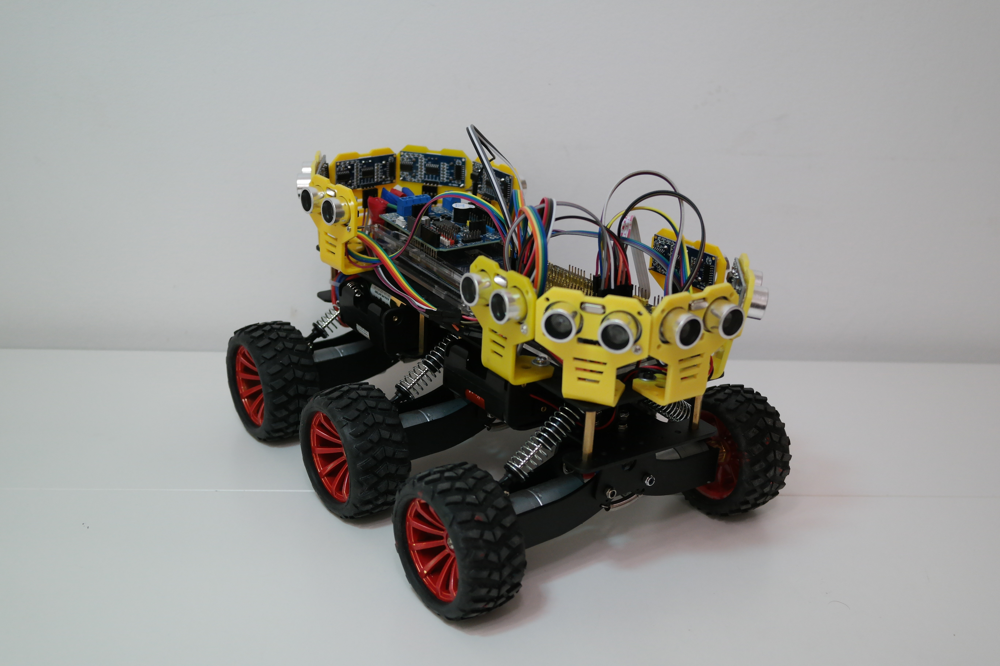

# Intelligent Mobile Robot
Intelligent Navigation System of Mobile Robot
 <b>Hardware</b> - Arduino Mega, Motor Shield L298P, DC Motors, Ultrasonic Sensors, Gyroscope, Laser Sensors, Cameras, Lidar Sensor, Bluetooth Module, Batteries, Six Wheel High Pass Base with Active Suspension.
 <b>Software</b> - C# via Visual Studio, Python, Arduino IDE, Android SDK, Matlab.
 <b>Develop</b> - Algorithms for Overcoming Obstacles, Algorithms for Localization, Algorithms for Mapping, SLAM Algorithms.

### Reference to:
[1] Valentyn N Sichkar. Intelligent Navigation System of Mobile Robot // GitHub platform [Electronic resource]. URL: https://github.com/sichkar-valentyn/Intelligent_Mobile_Robot (date of access: XX.XX.XXXX)

## Description
### Introduction
Explaining the main goals of the Project
 https://www.youtube.com/watch?v=srEd8KEh2uo
 

### Connecting DC Motors
Connecting and checking the High Pass Six Wheel Base - HPSWB - for simple commands to move
 https://www.youtube.com/watch?v=Ux8xrQHnlzI
 

### More information about equipment
General view of the Motor Shield L298P is shown below on the figure

 The view from the top of Motor Shield L298P and showing the main connectors that are needed for the Project.
 

 General view of the DC Motor
 

 Connection DC Motors to the Shield
 

 General view of the Bluetooth Module HC-06
 

 Connection Bluetooth Module HC-06 to the Shield or Arduino
 

 More about equipment
 https://www.youtube.com/watch?v=6KQcZUehVFo
 

 General view of the Ultrasonic Sensor US-015
 

 Connection Ultrasonic Sensor US-015 (or HC-SR04) to the Arduino
 

 Equations for Ultrasonic Sensors, explaining how they work
 

### Adding FIVE Ultrasonic sensors US-015
Checking the environment around with Ultrasonic Sensors US-015
 HPSWB with Ultrasonic Sensors - view from the front

 HPSWB with Ultrasonic Sensors - view from the back

 HPSWB with Ultrasonic Sensors - view from one side

### Figure below shows the results of working system in Real Time by SPARQL Querying of the Knowledge Base

### This figure shows the results of Neural Network Knowledge Base

### Checking the abilities to stop before the possible collisions with obstacles
With the help of Ultrasonic Sensors and seeing the obstacles to avoid the collisions
 https://www.youtube.com/watch?v=QVCCuo-QOwA
 

### Adding TEN Ultrasonic sensors HC-SR04
Checking the environment around with Ten Ultrasonic Sensors HC-SR04
 HPSWB - view from the front

### Connecting two Arduino Mega together
The way how to connect Master and Slave Arduino Mega together through Serial Port
 

### Checking the abilities to overcome obstacles
Implementing and testing Algorithms for HPSWB
 https://www.youtube.com/watch?v=rjMo-d7WrMY
 

### Adding Gyroscope
Adding Gyroscope in order to rotate HPSWB precisely to a needed degree regardless of battery charge

### Creating program in Matlab
Using Matlab to build the Map around the Mobile Robot with the information from Ultrasonic Sensors

### Creating the Mobile Application Arduino-Android
Application to control the HPSWB via phone

### Adding Laser Sensors
Another type of Sensors to check the environment

### Adding Lidar Sensor
Checking the environment with Lidar Sensor

### Adding Camera
Working with Computer Vision

### Implementing Algorithms for Obstacle Overcoming
Working with Algorithms

### Implementing Machine Learning
Working with Machine Learning

### Implementing Neuro Networks
Working with Neuro Networks

## MIT License
## Copyright (c) 2017-2018 Valentyn N Sichkar
## github.com/sichkar-valentyn
### Reference to:
[1] Valentyn N Sichkar. Intelligent Navigation System of Mobile Robot // GitHub platform [Electronic resource]. URL: https://github.com/sichkar-valentyn/Intelligent_Mobile_Robot (date of access: XX.XX.XXXX)
