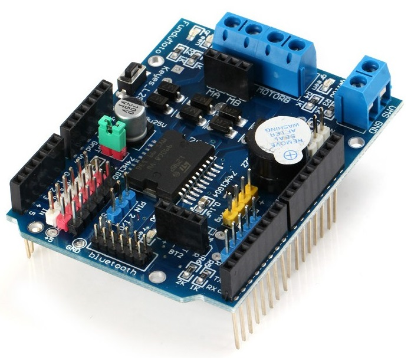
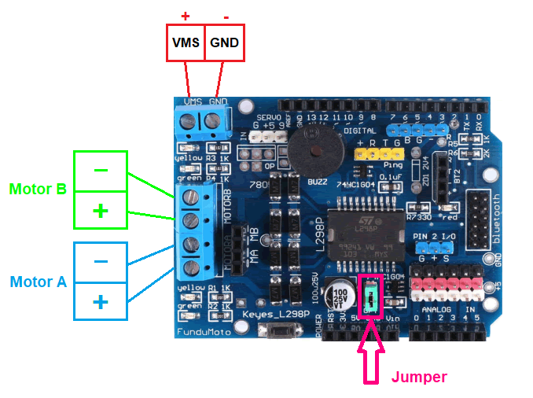
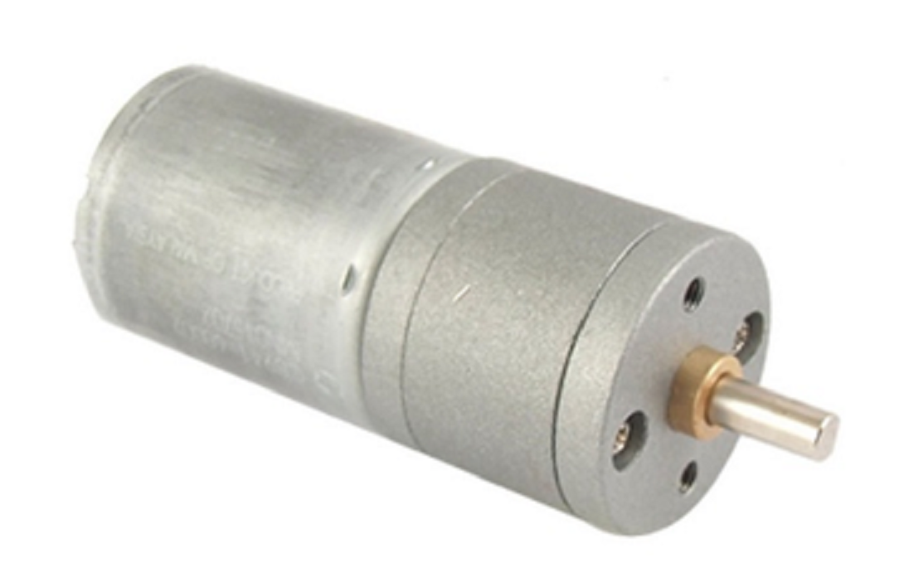
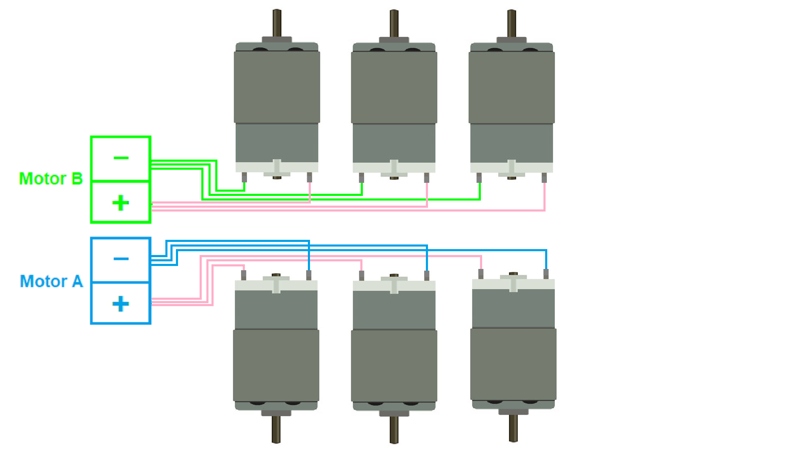
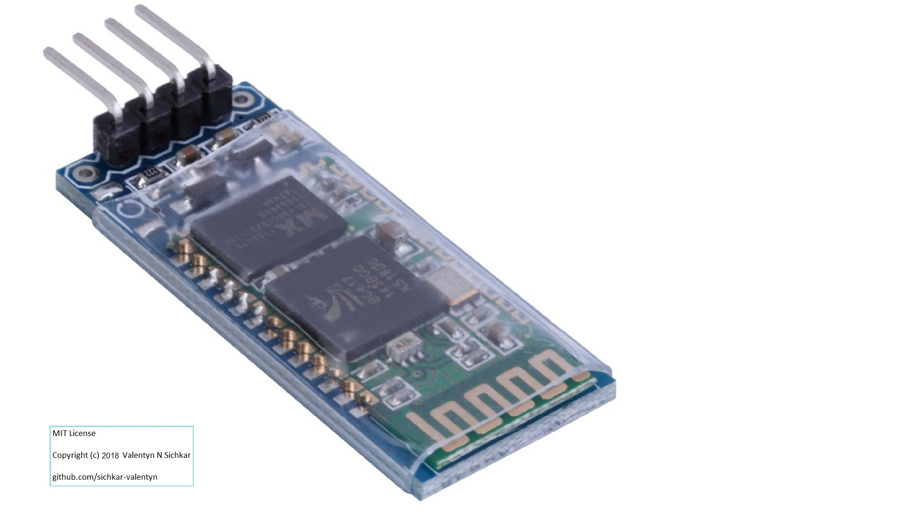
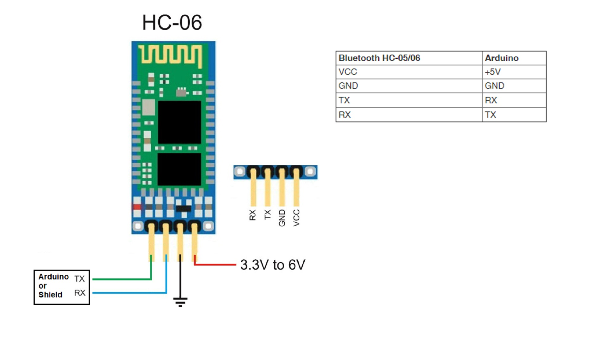

# Intelligent Mobile Robot
Movements Control of Mobile Robot.
 <b>Hardware</b> - Arduino Mega, Motor Shield L298P, 6 DC Motors, 6 Ultrasonic Sensors, Bluetooth Module, Batteries.
 <b>Software</b> - C# via Visual Studio, Arduino IDE, Android SDK.

### Reference to:
[1] Valentyn N Sichkar. Intelligent Movements Control of Mobile Robot // GitHub platform [Electronic resource]. URL: https://github.com/sichkar-valentyn/Intelligent_Mobile_Robot (date of access: XX.XX.XXXX)

## Description
### Introduction
 Explaining the main goals of the Project.
 https://www.youtube.com/watch?v=srEd8KEh2uo
 

### Connecting DC Motors
 Connecting and checking the Six Wheel Base (SWB) for simple commands to move.
 https://www.youtube.com/watch?v=Ux8xrQHnlzI
 

### More information about equipment
 General view of the Motor Shield L298P is shown below on the figure.

 The view from the top of Motor Shield L298P and showing the main connectors that are needed for the Project.
 

 General view of the DC Motor.
 

 Connection DC Motors to the Shield.
 

 General view of the Bluetooth Module HC-06.
 

 Connection Bluetooth Module HC-06 to the Shield or Arduino.
 

 More about equipment.
 https://www.youtube.com/watch?v=6KQcZUehVFo
 

### Checking the abilities to overcome obstacles
 Implementing High Pass Six Wheel Base.

### Creating the Mobile Application Arduino-Android
 Application to control the SWB via phone.

### Adding the Ultrasonic sensors
 Checking the environment around with Ultrasonic sensors.

 General view of the Ultrasonic Sensor US-015.
 

 Connection Ultrasonic Sensor US-015 to the Arduino.
 

### Checking the abilities to stop before the possible collisions with obstacles
 With the help of Ultrasonic sensors and seeing the obstacles to avoid the collisions.

### Adding the camera
 Working with computer vision.

 Project is under construction
 _on its way ..._

## MIT License
## Copyright (c) 2017 Valentyn N Sichkar
## github.com/sichkar-valentyn
### Reference to:
[1] Valentyn N Sichkar. Intelligent Movements Control of Mobile Robot // GitHub platform [Electronic resource]. URL: https://github.com/sichkar-valentyn/Intelligent_Mobile_Robot (date of access: XX.XX.XXXX)
